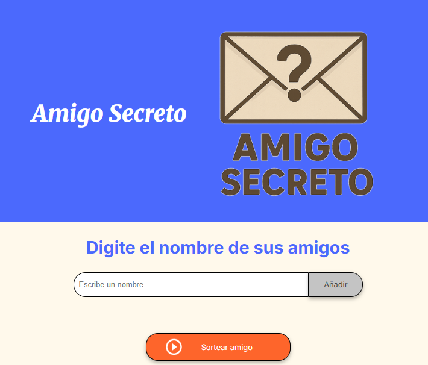

# challenge-amigo-secreto 
## Amigo Secreto 🎁
Proyecto de programación:

Aplicación web interactiva desarrollada como parte de un reto de programación, cuyo objetivo es fortalecer habilidades en JavaScript. 
La aplicación permite al usuario crear una lista personalizada de amigos y luego seleccionar uno al azar, ideal para juegos de **Amigo Secreto**.

## Funcionalidades
- Agregar nombres a una lista de amigos.
- Validar que el campo no esté vacío
- Mostrar la lista actualizada en pantalla.
- Sortear un nombre aleatorio.

## 📁 Estructura

    amigo-secreto/
    ├── index.html        # Página principal
    ├── style.css         # Estilos de la aplicación
    ├── app.js            # Lógica principal
    ├── assets/           # Recursos
    │ ├── amigo-secreto.png
    │ └── play_circle_outline.png
    └── README.md    

## 🎮 Cómo usar

### 1) Agregar amigos
- Escribe un nombre en el campo de texto
- Presiona **Enter** o haz clic en **Añadir**
- El nombre aparecerá en el listado

### 2) Sortear
- Haz clic en **Sortear amigo**

1. Escribe el nombre de un amigo en el campo de texto.
2. Haz clic en **"Agregar"** para incluirlo en la lista.
   - Solo se aceptan letras y espacios.
   - No se permiten nombres repetidos.
3. Una vez que tengas al menos **dos nombres**, presiona **"Sortear Amigo"** para elegir uno al azar.
4. Si quieres empezar de nuevo, presiona **"Reiniciar"**.

## 📌 Tecnologías utilizadas
- HTML
- CSS
- JavaScript

## 📸 Capturas de pantalla

### Vista inicial

## Autor
Patricia Aros en colaboracion con Alura Latam 
- GitHub: paros
- Email: aros.patricia@gmail.com
